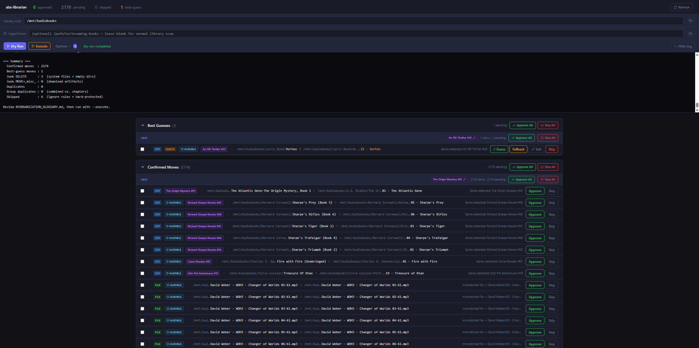

# abs-librarian

Reorganizes an [Audiobookshelf](https://www.audiobookshelf.org/) library to the expected directory structure:

```
Author Name/
  Standalone Book/
    audiofile.mp3
  Series Name/
    01 - Book Title/
      audiofile.mp3
```

Runs in two phases: **dry-run** (generates a plan you review) then **execute** (applies it). Never deletes real audio files.

---

## Prerequisites

- **Node.js 18+** and npm
- A path to your Audiobookshelf library (a directory of authors/books)

---

## Quickstart — GUI (recommended)

The web GUI is the easiest way to use abs-librarian. It lets you trigger scans, review every proposed move, resolve duplicates and conflicts side-by-side, and run the actual file operations — all from the browser.



```bash
git clone https://github.com/nathansupinski/abs-librarian.git
cd abs-librarian
npm install                  # install server dependencies
npm run build:gui            # one-time build of the React frontend
npm run start:gui            # starts the server and opens http://localhost:7000
```

That's it. The browser will open automatically.

In the GUI:

1. Enter your **Library root** (e.g. `/mnt/user/Audiobooks`) and click **Dry Run**.
2. Watch the live terminal log; when the scan finishes, the plan loads automatically.
3. Review the sections:
   - **Ingestion Conflicts** (ingest mode only) — books that already exist in the library
   - **Best Guesses** — items the scanner wasn't fully confident about
   - **Duplicates / Group Duplicates** — side-by-side comparison with a recommendation
   - **Moves** — grouped by author → book → disc
4. Approve or skip items (individually, in groups, or by shift-click range).
5. Click **Execute** to apply the approved plan. Output streams live.

The GUI writes every change back to `plan.json` immediately, so it's safe to close the tab and come back later — or to mix GUI review with CLI execution.

### After the first run

You only need to run `npm install` and `npm run build:gui` once (and again after a `git pull`). For day-to-day use just:

```bash
npm run start:gui
```

The server accepts a couple of flags:

```bash
node gui.mjs [--port 7000] [--no-open] [--root /path/to/Audiobooks]
```

`--root` is only used when no `plan.json` exists yet; once a plan is generated the library root is read from it.

### Dev mode (hot reload)

If you're hacking on the frontend:

```bash
npm run dev
```

This runs the API server (nodemon, port 7000) and the Vite dev server (port 5173) concurrently. Open `http://localhost:5173`.

---

## GUI features

- **Dry Run / Execute buttons** — run scans and apply the plan from the browser; live output streams to a built-in terminal log
- **Approve / skip** individual moves or entire groups (grouped by author → book → disc)
- **Batch select** — shift-click a range, then approve or skip in one click
- **Best-guess resolution** — accept the suggested destination, use `_NeedsReview/`, or pick a custom path with a directory browser
- **Duplicate resolution** — side-by-side file comparison (size, bitrate, duration, codec, ID3 tags) with an auto-recommendation; confirm which copy to keep and a plan item is added automatically (move or delete, depending on your duplicates folder setting)
- **Group duplicate resolution** — for folders containing both a single combined audiobook file and individual chapter files, choose which version to keep; the discarded files are queued for move or deletion
- **Ingestion mode** — fill in the "Ingest from" field to scan a staging folder and plan moves into your library; conflicts (books that already exist) are surfaced in an "Ingestion Conflicts" section with Keep New / Keep Existing / Not a conflict buttons
- **Execute options** — checkboxes for all execute flags; the GUI remembers which flags you had active

The CLI and GUI can be used together — the CLI respects `approved`/`skipped` statuses set by the GUI.

---

## CLI usage

If you prefer the command line (or want to run abs-librarian as part of a script), the same workflow is available without the GUI.

### Basic two-phase run

```bash
# 1. Generate the plan (no files touched)
node reorganize.mjs --root /path/to/Audiobooks

# 2. Review
cat /path/to/Audiobooks/REORGANIZATION_GLOSSARY.md

# 3. Execute
node reorganize.mjs --root /path/to/Audiobooks --execute
```

Set `AUDIOBOOKS_ROOT` to avoid repeating the path:

```bash
export AUDIOBOOKS_ROOT=/mnt/user/Audiobooks
node reorganize.mjs          # dry-run
node reorganize.mjs --execute
```

Or use the npm script aliases:

```bash
npm run dry-run -- --root /path/to/Audiobooks
npm run execute -- --root /path/to/Audiobooks
```

The CLI generates the same `plan.json` the GUI reads, so you can mix-and-match: dry-run from the CLI, review/approve in the GUI, execute from either side.

---

## Ingest mode — moving new books into an existing library

If you keep new arrivals in a staging folder and want to merge them into your library, use ingest mode. abs-librarian will scan the staging folder, plan moves into your library, and surface any books that already exist as **conflicts** (path collision or matching ID3 artist+album).

### In the GUI

Fill in the **Ingest from** field below the library-root input. The "Dry Run" button label flips to "Ingest (Dry Run)". Conflicts appear in a dedicated "Ingestion Conflicts" section at the top of the plan; resolve each one before executing.

### From the CLI

```bash
# 1. Scan the staging folder; plan moves into the library
node reorganize.mjs --root /path/to/Audiobooks --ingest /path/to/Incoming

# 2. Review the plan (open the GUI to resolve any conflicts side-by-side)

# 3. Execute (same command as normal — sourceRoot is read from plan.json)
node reorganize.mjs --root /path/to/Audiobooks --execute
```

Conflict resolution options (in the GUI):

- **Keep New** — replace library copy; the old file moves to your duplicates folder if set, else deletes with `--delete-junk`
- **Keep Existing** — ingested file stays in the staging folder; no move performed
- **Not a conflict** — perform the move as if no conflict existed

---

## Execute Flags

| Flag | Effect |
|---|---|
| `--root <path>` | Path to Audiobooks root (default: `$AUDIOBOOKS_ROOT` or `/mnt/user/Audiobooks`) |
| `--ingest <path>` | Ingest from this folder into `--root` instead of scanning `--root` directly. The scanned folder is the source; `--root` is the destination library. Detects books that already exist in the library as conflicts. |
| `--execute` | Apply all pending/approved moves from plan.json |
| `--auto-accept-review` | Use best-guess destinations instead of `_NeedsReview/` |
| `--delete-junk` | Delete system files, Mac metadata, empty dirs, download artifacts |
| `--delete-empty-shells` | After moves, recursively remove dirs containing no audio |
| `--force-delete-audio-junk` | Bypass audio-extension safety check (rarely needed; `._*` forks are auto-detected) |
| `--retry-failed` | Retry items that failed in a previous execute run |
| `--ignore-file <path>` | Custom ignore file (default: `<root>/.audiobooksignore`) |
| `--duplicates-folder <path>` | Move resolved duplicates to this folder instead of deleting them (stored in plan.json; also configurable in the GUI) |
| `--scope <substr>` | Limit dry-run scan to top-level dirs whose name contains this substring (debug aid) |
| `--debug-rules` | Verbose rule decisions on stdout (equivalent to `ABS_DEBUG_SERIES=1`) |

**Recommended (full cleanup):**

```bash
node reorganize.mjs --root /path/to/Audiobooks --execute --auto-accept-review --delete-junk --delete-empty-shells
```

**Conservative (moves only):**

```bash
node reorganize.mjs --root /path/to/Audiobooks --execute
```

---

## Plan Item Statuses

| Status | Meaning |
|---|---|
| `pending` | Not yet reviewed — CLI will execute this item |
| `approved` | Explicitly confirmed in the GUI — CLI will execute this item |
| `skipped` | Denied/skipped — CLI will not process this item |
| `done` | Successfully executed |
| `failed` | Execution failed; use `--retry-failed` to retry |

---

## The Ignore File

Copy `.audiobooksignore.example` to your Audiobooks root as `.audiobooksignore` and edit it:

```bash
cp .audiobooksignore.example /path/to/Audiobooks/.audiobooksignore
```

The format works like `.gitignore`:

```
# Trailing / = directories only
Encrypted/

# No slash = match any path component at any depth
.stfolder

# Full path pattern (contains /)
some/specific/path
```

Paths matched by an ignore rule are left untouched and listed in the glossary Skipped section.

---

## What Happens to Each File Type

| Item | Without `--delete-junk` | With `--delete-junk` |
|---|---|---|
| Confirmed / approved moves | Applied | Applied |
| Best-guess items | → `_NeedsReview/` | → `_NeedsReview/` |
| Best-guess + `--auto-accept-review` | → best-guess dest | → best-guess dest |
| System files (`.DS_Store`, `._*`, etc.) | Left in place | Deleted |
| Download artifacts (`.nzb`, `.sfv`, `.URL`) | → `_misc/` subfolder | Deleted |
| Empty directories | Left in place | Deleted |
| Duplicates (resolved, delete mode) | Left in place | Deleted |
| Duplicates (resolved, move mode) | → duplicates folder | → duplicates folder |
| Duplicates (unresolved) | Left in place (flagged) | Left in place (flagged) |
| Group duplicates (resolved, delete mode) | Left in place | Deleted |
| Group duplicates (resolved, move mode) | → duplicates folder | → duplicates folder |
| Group duplicates (unresolved) | Left in place (flagged) | Left in place (flagged) |
| Ingest conflict (Keep New, move mode) | Library copy → dup folder; ingested → library | Same |
| Ingest conflict (Keep New, delete mode) | Library copy left in place (junk-pending) | Library copy deleted; ingested → library |
| Ingest conflict (Keep Existing) | Ingested file stays in ingest folder | Same |
| Ingest conflict (Not a conflict) | Ingested → library (move performed) | Same |
| Ingest conflict (unresolved) | Ingested file stays in ingest folder (flagged) | Same |
| Ignore-matched paths | Always left in place | Always left in place |
| `._*.mp3` Mac resource forks | Left in place | Deleted (auto-detected as non-audio) |

---

## After Execution

**Review `_NeedsReview/`** — files the script couldn't confidently place. Use the GUI's best-guess section or move manually.

**Resolve duplicates** — use the GUI's Duplicates section to compare files and mark which to keep. The discarded file is moved to the duplicates folder (if configured) or queued for deletion (requires `--delete-junk` at execute time). Configure the folder in the GUI's Options panel or via `--duplicates-folder` at dry-run time.

**Resolve group duplicates** — the GUI's Group Duplicates section shows folders containing both a combined audiobook file and individual chapter files. Choose which version to keep; the discarded files are moved or queued for deletion on the next execute.

**Resolve ingestion conflicts** — when ingesting new books with `--ingest`, the GUI's Ingestion Conflicts section lists books that already exist in the library (by destination path OR matching ID3 artist+album). Pick Keep New to replace the library copy, Keep Existing to leave the ingestion source untouched, or Not a conflict to perform the move as if no conflict existed. Unresolved conflicts block their corresponding move at execute time.

**Rescan Audiobookshelf** — Settings → Libraries → (your library) → Scan Library.

---

## Restartability

`plan.json` is written after every item during execute. Interrupt at any time and re-run `--execute` to pick up where it left off. Add `--retry-failed` to also retry failed items.

---

## Execute Log

Each execute run appends to `execute.log` next to the script:

```
=== EXECUTE RUN: 2026-04-30T06:08:00Z ===
Flags: --execute --auto-accept-review --delete-junk --delete-empty-shells
Items: 350 pending

DONE   renamed  Aasif Mandvi → Aasif Mandvi/Sakina's Restaurant
DONE   deleted  John Ringo/Strands of Sorrow/._foo.mp3
FAIL   move     SomeBook: some error message
--- SUMMARY: 349 done, 0 skipped, 1 failed ---
```

---

## Detection Rules

The scanner uses a modular rules engine. Rules live in `src/rules/` — any `.mjs` file with a default export extending `ScanRule` is auto-loaded. Rules run in priority order; the first rule that claims a directory stops the chain.

**Built-in rules:**

- **Dot-separated naming** (`dot-separated-format.mjs`) — folders named `Author.Name.-.Series.NN.-.Title` (any author, not just Lee Child) are reorganized to `Author/Series/NN - Title/`
- **Series-code naming** (`series-code-format.mjs`) — M.C. Beaton `AR##`/`HM##` series codes and `Agatha Raisin NN - Title` patterns; partial disc folders (`XofY`) become `Disc N` subfolders
- **Combined + chapters** (`combined-chapters-duplicate.mjs`) — detects folders containing both a single large combined audiobook and many individual chapter files; presents a group duplicate for user resolution
- **Nested series container** (`nested-series-container.mjs`) — detects a "mixed leaf": a single directory directly holding audio files from 2+ different books (distinct ID3 album tags). Extracts each book to `Author/Series/[Seq - ]Title/` using album tags as ground truth and provider lookups for sequence numbers. Handles the common case where several books were dumped into one folder, or where previous scan runs created incorrect nesting. Does not touch series whose books are already split into per-book subfolders
- **Mismatched files** (`mismatched-files-in-folder.mjs`) — detects audio files whose ID3 album tag doesn't match their container folder name; moves each file to the correct `Author/Album/` location
- **Root-level MP3s** — ID3 tags first; falls back to the metadata provider cascade; ambiguous → `_NeedsReview/`
- **Loose audio in author folders** — wrapped in a per-book subfolder using the ID3 album tag as the title
- **Top-level book folders** — remapped via `user-mappings.json` + ID3 verification, or detected automatically via ID3 + metadata providers

**Adding a new rule:** create `src/rules/my-rule.mjs` with a class extending `ScanRule` from `./BaseRule.mjs`, override `onBookDir` and/or `onAuthorDir`, return `true` when handled. No other changes needed.

---

## Metadata Providers

When ID3 tags don't supply enough context (missing author, ambiguous results), the scanner queries external book databases to identify and confirm metadata. Providers are tried in priority order; the first result with sufficient confidence wins.

| Provider | Priority | Notes |
|---|---|---|
| **Audible** | 1st | Best audiobook coverage; returns duration, narrator, series. Used for confidence scoring. |
| **OpenLibrary** | 2nd | Broad book database; free, no auth |
| **Google Books** | 3rd | Fallback; good description and genre data |
| **Audnexus** | Enrichment | Called only when a prior provider returns an ASIN; adds narrator and chapter data |

**Confidence scoring** follows the same weighted formula as Audiobookshelf: duration match (0.7) + title similarity (0.2) + author similarity (0.1). When no duration is available, the title+author weights are normalized to fill the 0–1 range.

When a provider confirms a move, the plan item gets a `providerMatch` field and the GUI shows a blue badge (e.g. **Audible**) next to the item type badge. Expanding the row shows the matched title, author, series, and confidence percentage.

Rules can access the provider system via `ctx.resolveMetadata({ title, author, duration })`, which returns a `ResolverResult` or `null`.

---

## User Mappings

`user-mappings.json` (at the project root) handles top-level folders whose names are book titles rather than author names. Edit it to add your own mappings without touching source code:

```json
{
  "knownMisplaced": {
    "The Golden Compass": {
      "author": "Philip Pullman",
      "series": "His Dark Materials",
      "title": "The Golden Compass",
      "confidence": "high",
      "note": "Philip Pullman, His Dark Materials book 1"
    }
  }
}
```

The file ships with several example entries. If the file is missing, the scanner falls through to the automatic ID3 + OpenLibrary detection path.

---

## Files

| Path | Purpose |
|---|---|
| `reorganize.mjs` | CLI entry point (thin wrapper) |
| `gui.mjs` | GUI server entry point |
| `src/cli.mjs` | Commander-based CLI — arg parsing, orchestrates core modules |
| `src/gui-server.mjs` | Express API server + process runner (dry-run/execute, SSE streaming) |
| `src/core/constants.mjs` | `HARD_SKIP`, extension sets (`AUDIO_EXTS`, `JUNK_EXTS`, `SYSTEM_NAMES`) |
| `src/core/fs-utils.mjs` | `safeMove`, `deleteItem`, `copyTree`, `cleanEmptyShells`, `isAudio`, etc. |
| `src/core/ignore.mjs` | `loadIgnoreFile`, `matchedIgnoreRule` |
| `src/core/metadata.mjs` | `readTags`, `recommendDuplicate`, `searchOpenLibrary` (legacy) |
| `src/providers/` | Metadata provider system — `BaseProvider`, four provider implementations, `MetadataResolver` |
| `src/core/plan.mjs` | `createPlanState`, `writePlan` (atomic), `buildPlanOutput`, `writeGlossary` |
| `src/core/scanner.mjs` | `runDryScan` — three-pass scan, rule runner, classifier helpers; ingest-mode conflict wrapping |
| `src/core/executor.mjs` | `runExecute` — processes plan items, writes execute.log; accepts ingest `sourceRoot` |
| `src/core/library-index.mjs` | `buildLibraryIndex` — ingest-mode content index (artist+album → file paths) |
| `src/core/user-mappings.mjs` | Loads `user-mappings.json` from project root |
| `src/rules/BaseRule.mjs` | Abstract base class for scan rules |
| `src/rules/loader.mjs` | Auto-discovers and loads all rule files |
| `src/rules/*.mjs` | Individual rule implementations |
| `gui/` | Vite + React frontend source |
| `gui-dist/` | Built frontend — gitignored, generated by `npm run build:gui` |
| `user-mappings.json` | User-editable folder-name→author mappings (replaces hardcoded list) |
| `nodemon.json` | Nodemon config for `npm run dev` |
| `package.json` | Root package — `commander`, `express`, `music-metadata` |
| `.audiobooksignore.example` | Template ignore file — copy to your Audiobooks root |
| `CLAUDE.md` | Technical reference for AI-assisted development |
| `plan.json` | Generated at runtime — gitignored |
| `execute.log` | Generated at runtime — gitignored |
| `<root>/REORGANIZATION_GLOSSARY.md` | Human-readable dry-run report — generated in library root |
